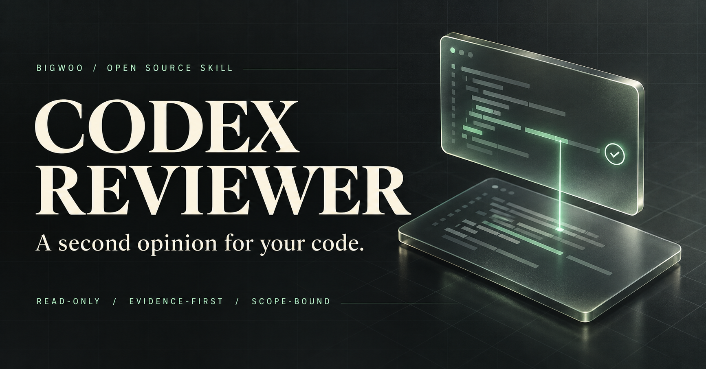

<div align="center">



# Codex Reviewer

### 寫完程式，再多一雙眼睛。

讓獨立的 Codex CLI 審查你的變更，找出有證據、能修正的問題。<br />
**唯讀審查 · 明確範圍 · 可保存的審查結果**

[](https://github.com/BIGWOO/codex-reviewer/releases)
[](https://github.com/BIGWOO/codex-reviewer/actions/workflows/test.yml)


[English](README.md) · **繁體中文**<br />

[為什麼要裝？](#why-install) · [開始安裝](#install) · [看看怎麼用](#quick-start) · [選擇審查強度](#presets) · [完整使用手冊](references/usage-guide.md)

</div>

---

## 把第二意見，放進你的開發流程

主代理完成實作後，交給另一個獨立、唯讀的 Codex CLI 程序審查。Reviewer 提供問題與證據，由主代理核對，再依你的授權處理。

適合想在交付前多確認一次的開發者：未提交的修改、分支差異、單一 commit，或特定檔案與程式片段，都能明確指定。

| 你在意的事 | Codex Reviewer 的做法 |
|---|---|
| **別把程式改亂了** | Reviewer 以唯讀模式執行，不提交、推送、合併或部署 |
| **別只給空泛建議** | 優先回報具體觸發條件、影響、檔案／行號證據與最小修法 |
| **別一路審到天邊** | 固定審查範圍；bounded 模式只接收封裝的程式與驗證證據，禁止工具 |
| **結果要能交接** | 可輸出 structured findings、JSON 結果及品質關卡狀態 |

> **它是一份第二意見。** 主代理仍須核對 findings；審查沒有發現問題，不代表測試已通過。

<a id="why-install"></a>

## 不安裝也能審查，安裝後省下什麼？

**如果你只想偶爾看一次 diff，官方 `/review` 就很適合。** 如果你希望每次交付都遵守相同的範圍、模型、輸出格式與失敗處理規則，這個 skill 把這些步驟整理成可重用流程。

| 使用情境 | 不安裝這個 skill | 安裝 Codex Reviewer |
|---|---|---|
| 臨時審查修改 | 直接用官方 `/review` 或 `codex review` | 用 `$codex-reviewer`，主代理依需求選模式 |
| 每次固定審查規則 | 使用官方設定、專案規則或自行維護提示與腳本 | 共用審查重點、preset 與 preflight 檢查已封裝 |
| 只送特定片段與測試證據 | 自行抽取、封裝並約束 reviewer | bounded packet 驗證範圍與證據，強制零工具 |
| 把結果接進工作流程 | 自行串接輸出解析與失敗處理 | 提供結果 envelope、品質關卡與 `--enforce-gate` 退出碼 |
| 管理執行狀態 | 自行處理重複執行、逾時、取消與終態判定 | 共用 repo 鎖、程序清理與終態驗證 |

安裝增加一份本地 Python helper 與需要維護的 CLI 相容性要求；模型審查仍使用你設定的 Codex 服務與額度。**唯讀描述的是工作區權限，不代表程式碼不會送到模型服務。** 安裝本身也不保證找到更多 bug、降低用量，或取代測試。

## 與官方 Codex 審查有什麼差別？

**這是社群維護、建立在官方 Codex CLI 上的流程封裝，並非 OpenAI 官方產品。** 官方審查本來就能取得獨立的審查意見，並以具體、按優先順序排列的問題為目標；本 skill 的特色是把範圍、工具限制、結果驗證與品質關卡一起封裝。

| 面向 | 官方 Codex | 這個 skill 多做的事 |
|---|---|---|
| 程式碼審查 | CLI `/review` 可審未提交變更、commit、base branch 或自訂指示 | 統一入口與模式選擇；native 模式仍使用官方審查規則 |
| 唯讀與執行控制 | 官方 review 不修改工作區；CLI 也提供 sandbox 與設定控制 | 明確套用 read-only、ephemeral、停用 hooks 與一般代理委派等政策 |
| Structured output | 官方 `codex exec --output-schema` 可產生指定格式 | 封裝內建 findings schema、結果 envelope、本地驗證與 gate 判定 |
| 精確範圍 | 官方支援 Git 審查範圍與提示指定需求 | bounded 模式將確切片段、差異與 evidence 封裝成 packet，禁止 child tools |
| 自動 PR 審查 | 官方 GitHub 整合支援 `@codex review` 與自動審查 | 聚焦本地與主代理流程；安裝後不會自動啟用 GitHub PR bot |

**首選建議：** 臨時看一次修改，直接用官方功能；希望團隊或主代理穩定重複同一套交付審查流程，再安裝這個 skill。你也能用官方 CLI 自行寫出類似流程，這個 repo 讓你少維護一套封裝。

比較依據：[官方 CLI 文件](https://learn.chatgpt.com/docs/codex/cli)、[官方 structured review 範例](https://github.com/openai/openai-cookbook/blob/main/examples/codex/build_code_review_with_codex_sdk.md)、[官方 GitHub 審查整合](https://learn.chatgpt.com/docs/third-party/github)。CLI 細節以本 repo 的 `0.159.3` 相容性基準為準，見[能力核對](references/codex_cli_reference.md)。

<a id="install"></a>

## 01 / 安裝

需要 **Python 3.10+、Git，以及已登入的 Codex CLI**。最低 stable CLI 版本為 `0.159.3`；缺少或過舊時，helper 預設會安裝／升級 CLI。帳號也需要能使用預設模型 `gpt-6.1-sol`。

### 安裝 Skill

建議以 `~/.agents/skills` 作為單一安裝來源：

```bash
git clone https://github.com/BIGWOO/codex-reviewer.git \
  "$HOME/.agents/skills/codex-reviewer"
```

已安裝的使用者，可先確認沒有本地修改，再以 `git pull --ff-only` 更新；若有修改或分支分歧，先保留並處理，不覆蓋。

### 確認環境

```bash
SKILL_DIR="$HOME/.agents/skills/codex-reviewer"
python3 "$SKILL_DIR/scripts/codex_review.py" doctor
```

`doctor` 檢查 CLI、設定、已儲存登入狀態與模型清單，不執行模型審查。登入狀態通過，仍不代表遠端模型權限已驗證。

安裝完成後，在下一則 Codex 訊息使用 `$codex-reviewer`。若你的宿主只讀取 `~/.codex/skills`，請參考下方的相容設定。

<details>
<summary><strong>宿主只讀取 ~/.codex/skills？</strong></summary>

在 macOS／Linux，可將同一份 skill 連結到宿主的 skills 目錄。僅在目標路徑尚不存在時建立；已有安裝或連結就先確認來源。

```bash
mkdir -p "$HOME/.codex/skills"
ln -s "$HOME/.agents/skills/codex-reviewer" \
  "$HOME/.codex/skills/codex-reviewer"
```

Windows 的路徑與程序管理注意事項見[使用手冊](references/usage-guide.md#windows-執行相容性)。

</details>

<a id="quick-start"></a>

## 02 / 第一次使用

### 在 Codex 裡，直接說你想審什麼

```text
$codex-reviewer 請獨立審查目前未提交的修改，使用 standard。
只回報本次變更中有具體證據、可以修正的問題，先不要修改。
```

也可以指定：

```text
$codex-reviewer 比較目前分支與 main，檢查相容性與邊界情境。
```

```text
$codex-reviewer 只審查付款流程這次的修改，使用 deep。
```

Skill 會依需求選擇 bounded 或 structured 等模式，並套用副作用、相容性、邊界、效能及安全等審查重點。

### 在終端機，保存一份審查結果

```bash
SKILL_DIR="$HOME/.agents/skills/codex-reviewer"
python3 "$SKILL_DIR/scripts/codex_review.py" structured-review \
  --cd /path/to/your/repo \
  --uncommitted \
  --preset standard \
  --result-json /tmp/codex-review-result.json
```

將 `/path/to/your/repo` 換成專案路徑。審查分支時，用 `--base main` 取代 `--uncommitted`；審查單一提交則用 `--commit <SHA>`。

> 想先看看將執行什麼？加上 `--dry-run --no-update-check`，預覽命令，不呼叫模型。

<a id="presets"></a>

## 03 / 選擇審查強度

**日常使用 `standard`。** 複雜或高價值變更再選 `deep`；`quick` 適合初步篩查。

| Preset | 模型 | 推理等級 | 適合情境 |
|---|---|---|---|
| `quick` | GPT-6.1 Sol | `medium` | 快速找阻塞問題，不作正式品質關卡 |
| **`standard`** | **GPT-6.1 Sol** | **`high`** | **日常審查的預設選擇** |
| `deep` | GPT-6.1 Sol | `xhigh` | 複雜、高價值變更 |
| `ultra` | GPT-6.1 Sol | `ultra` | 明確啟用的 generic 分工審查 |

所有 preset 使用 `gpt-6.1-sol`，先依模型清單驗證能力；模型或所需推理等級不可用時回報原因，不自動改用其他模型。可用 `--model` 明確指定其他有效模型；已退役模型拒絕使用。

所有審查停用 hooks。一般審查禁止代理委派；generic `ultra` 才允許分工，代理並行上限為 2。Native 與 bounded 不支援 ultra。

<details>
<summary><strong>模型清單、max 與 context 的進階限制</strong></summary>

模型清單優先刷新；失敗時可使用 bundled catalog 並警告，但不保證帳號權限。`--full-context` 只恢復 plugins／apps，不改變 hooks 與代理委派限制。

`max` 不是 preset，須明確指定 `--reasoning-effort max`，且只允許完整 sizing 的單一 repo，最多 15 個 changed files／1200 changed lines，不能用 `--allow-large-diff` 繞過。

</details>

<a id="modes"></a>

## 04 / 依工作選模式

| 想做什麼 | 模式 |
|---|---|
| 保存穩定的 JSON findings | `structured-review` |
| 只看特定程式片段與驗證證據，禁止 reviewer 使用工具 | `bounded-review` |
| 使用 Codex 內建審查規則 | `native-review` |
| 自訂條件或安全、效能、架構等專項審查 | `custom`、`security`、`performance`、`architecture` 等 generic 模式 |
| 確認安裝與環境 | `doctor` |

Native 使用 Codex 內建規則，不能套用同一份自訂提示、output schema、圖片或 live search。更多選擇見[模式與操作細節](references/operation-details.md)。

<a id="bounded-review-contract"></a>

### Bounded Review Contract

主代理先完成必要測試，再封裝確切程式範圍與實際驗證結果。Reviewer 只接收 packet，不重新跑測試；內容不足時回報證據缺口。

<details>
<summary><strong>展開：最小 scope、evidence 與執行範例</strong></summary>

`/tmp/review-scope.json`：

```json
{
  "version": 1,
  "kind": "commit_snapshot",
  "commit": "HEAD",
  "files": [
    {"path": "src/example.ts", "ranges": [{"start": 1, "end": 40}]}
  ]
}
```

檔名與行號須對應該 commit 的實際內容。也支援 `commit_diff` 與 `uncommitted_diff`。

`/tmp/review-evidence.json`（選填；填入你真正執行的結果）：

```json
{
  "version": 1,
  "checks": [
    {"name": "targeted tests", "status": "not_run"}
  ]
}
```

```bash
python3 "$SKILL_DIR/scripts/codex_review.py" bounded-review \
  --cd /path/to/your/repo \
  --bounded-scope /tmp/review-scope.json \
  --evidence-json /tmp/review-evidence.json \
  --preset standard \
  --enforce-gate \
  --result-json /tmp/codex-bounded-result.json
```

Scope／evidence 採嚴格格式驗證，bounded 固定零工具。完整格式、預算與限制見[Bounded 使用手冊](references/usage-guide.md#bounded-review-contract)。

</details>

## 怎麼看審查結果？

每個問題都應有觸發條件、影響與最小程式證據。主代理核實後，依授權決定修正或記錄不採納理由。

| 品質關卡 | 意義 | 使用 `--enforce-gate` 的退出碼 |
|---|---|---|
| `passed` | 沒有阻塞 finding | `0` |
| `passed_with_warnings` | 僅有 P3 問題 | `0` |
| `blocked` | 存在 P0–P2 問題 | `2` |
| 失敗／無法確認 | 逾時、取消、policy violation 或缺少有效終態 | `1`；取消另有專用退出碼 |

保留 reviewer 的原始結果；主代理不採納 finding，不等於把 `blocked` 改成通過。審查也不取代測試。

## 深入閱讀

| 文件 | 內容 |
|---|---|
| [完整使用手冊](references/usage-guide.md) | CLI 更新、binary 選擇、參數、跨 repo、自訂 schema 與平台限制 |
| [模式與操作細節](references/operation-details.md) | 依需求挑選模式與設定 |
| [CLI 相容性參考](references/codex_cli_reference.md) | 官方來源、能力核對、profile 與完整診斷 |
| [提示詞範例](references/example_prompts.md) | 自訂審查條件 |
| [Skill 工作規則](SKILL.md) | 代理的使用邊界、審查流程與品質關卡 |
| [v261001 英文發布文案](references/releases/v261001.en.md) | 英文版變更與驗證範圍 |
| [v261001 發布說明](https://github.com/BIGWOO/codex-reviewer/releases/tag/v261001) | 本版變更與驗證範圍 |

<details>
<summary><strong>常見問題</strong></summary>

**跟 Codex 子代理有什麼不同？**<br />
子代理適合主任務內的分工；本 skill 使用獨立、唯讀的 CLI 程序，固定範圍、模型與輸出契約，適合交付前取得第二意見。兩者可以互補，避免重複審查相同範圍。

**會自動改我的程式嗎？**<br />
Reviewer 不修改被審查 repo。主代理是否修正，依你授權的範圍決定。

**需要額外 Python 套件嗎？**<br />
一般與內建格式審查不需要；自訂 `--schema` 才需要選填的 `jsonschema` 依賴。見[安裝方式](references/usage-guide.md#自訂格式與驗證依賴)。

**會自動更新 CLI 嗎？**<br />
缺少或低於 `0.159.3` 時預設安裝／升級。`--no-update-check`、`--dry-run` 或明確 binary pin 不更新，但仍須符合最低版本。符合門檻後的定期更新須另外啟用。

**這版已經實跑所有模型審查了嗎？**<br />
沒有。v261001 的證據包含本地測試、CLI 契約、命令預覽與 doctor；未執行該版的真實模型審查。完整歷史見[驗證範圍](references/usage-guide.md#相容性與保護措施)。

</details>

---

<div align="center">

**下一次交付前，讓你的程式多一份有證據的第二意見。**

[安裝 Codex Reviewer](#install) · [回報問題](https://github.com/BIGWOO/codex-reviewer/issues)

</div>
